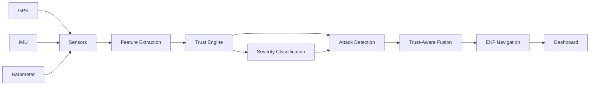
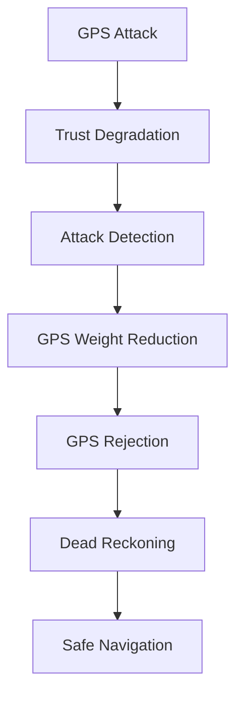

# AeroSentinel

Edge AI for Trust-Aware Autonomous Sensor Fusion Against GPS Spoofing

---

## Overview

AeroSentinel is an AI-powered navigation trust monitoring system for UAVs, autonomous vehicles, robotics platforms, and edge aerospace systems. It addresses a critical weakness in GPS-dependent autonomy: a vehicle can receive valid-looking GPS coordinates that are intentionally false.

GPS spoofing can make an autonomous system believe it is somewhere else, drifting it away from a safe route without obvious signal loss. AeroSentinel detects this behavior by comparing GPS data against onboard sensor estimates, generating a live trust score, classifying attack severity, and reducing GPS influence when navigation becomes suspicious.

When GPS becomes untrusted, the system maintains navigation using onboard sensors, Extended Kalman Filter fusion, and IMU dead reckoning. The dashboard visualizes this behavior in real time so observers can see the attack, the trust collapse, GPS rejection, and safe fused navigation.

---

## Key Features

- Sensor Simulation
- Feature Extraction
- Trust Engine
- Severity Classification
- GPS Spoof Detection
- GPS Rejection
- Extended Kalman Filter
- IMU Dead Reckoning
- Autonomous Navigation During Attack
- Trust-Aware Sensor Fusion
- Real-Time Dashboard

---

## System Architecture



---

## Trust Engine

The trust engine compares GPS-derived motion with onboard sensor estimates and fused navigation state. It converts disagreement into a trust score from `0` to `100`.

Core feature signals:

- `Distance Error`: Difference between GPS position and fused or inertial position.
- `Speed Error`: Difference between GPS speed and IMU-derived motion.
- `Altitude Error`: Difference between GPS altitude and barometer or fused altitude.
- `Heading Error`: Difference between GPS heading and inertial heading.

High agreement produces high trust. Large divergence, sudden jumps, and inconsistent velocity or heading reduce trust and increase attack severity.

| Severity | Trust Range | Meaning |
| --- | ---: | --- |
| NORMAL | 90-100 | GPS is consistent with onboard sensors. |
| SUSPICIOUS | 75-89 | Minor disagreement, continue monitoring. |
| MODERATE | 60-74 | Trust is degrading, reduce GPS influence. |
| SEVERE | 30-59 | Strong spoofing or drift evidence, favor IMU fusion. |
| CRITICAL | 0-29 | GPS rejected, dead reckoning active. |

---

## GPS Spoofing Detection Workflow



---

## Trust-Aware Sensor Fusion

AeroSentinel uses continuous trust-aware weighting rather than a simple accept-or-reject GPS switch.

Example during normal flight:

```text
Trust = 92
GPS Weight = 92%
IMU Weight = 8%
```

Example during spoofing:

```text
Trust = 21
GPS Weight = 21%
IMU Weight = 79%
```

This graceful degradation is safer than binary GPS rejection because the system can reduce GPS influence as evidence builds, maintain continuity during partial degradation, and avoid abrupt navigation jumps.

---

## Dashboard

The React dashboard provides a premium aerospace mission-control interface for real-time trust monitoring.

### Sidebar

- Mission Overview
- Trust Engine
- Sensor Status
- Alerts
- System Health

### Map View

- Aircraft Position
- GPS Path
- Fused Path
- True Path
- Smooth camera tracking
- Spoofing alert banner
- Trust-zone overlays

### Analytics

- Trust Timeline
- Distance Error
- Speed Error
- Altitude Error
- Heading Error
- Attack Timeline
- System Events
- Sensor Health

### Mission Panels

- Trust Engine gauge
- GPS trusted or rejected state
- Attack status
- Trust-aware GPS and IMU fusion weights
- Human-readable mission explanations
- Alert center with severity filtering
- Deployment health for Raspberry Pi 5 and Jetson Nano

---

## Demonstration Scenario

### Normal Flight

Expected behavior:

- Trust approximately `90+`
- Severity = `NORMAL`
- GPS accepted
- GPS path and fused path remain aligned
- Aircraft follows the safe route

### Spoofed Flight

Expected behavior:

- Trust drops significantly
- Severity becomes `SEVERE` or `CRITICAL`
- GPS influence is reduced
- GPS may be rejected
- Red GPS path visibly diverges
- Blue fused path remains stable
- Aircraft continues navigation using onboard sensors

---

## Project Structure

```text
VAIMANIK_SETU/
├── README.md
├── data/
│   ├── raw/
│   │   ├── delay_attack.csv
│   │   ├── drift_attack.csv
│   │   ├── jump_attack.csv
│   │   └── normal_flight.csv
│   ├── processed/
│   │   ├── features.csv
│   │   └── features_60k.csv
│   └── sample_data.csv
├── docs/
├── deployment/
├── frontend/
│   ├── README.md
│   ├── deployment.md
│   ├── index.html
│   ├── package.json
│   ├── postcss.config.js
│   ├── tailwind.config.js
│   ├── tsconfig.json
│   ├── vite.config.ts
│   └── src/
│       ├── App.tsx
│       ├── api/
│       │   └── client.ts
│       ├── components/
│       │   ├── charts/
│       │   ├── common/
│       │   ├── layout/
│       │   ├── map/
│       │   └── panels/
│       ├── hooks/
│       ├── mocks/
│       ├── types/
│       └── styles.css
├── models/
│   ├── predict.py
│   ├── train_autoencoder.py
│   ├── train_isolation_forest.py
│   ├── train_lstm_autoencoder.py
│   ├── train_xgboost.py
│   └── saved_models/
├── src/
│   ├── common/
│   ├── features/
│   ├── fusion/
│   ├── simulator/
│   ├── trust_engine/
│   └── main.py
└── tests/
```

---

## Installation

### Backend Setup

```bash
python -m venv .venv
.venv\Scripts\activate
pip install numpy pandas scikit-learn torch xgboost
```

Run the current Python pipeline:

```bash
python src/main.py
```

### Frontend Setup

```bash
cd frontend
npm install
npm run dev
```

Build for production:

```bash
npm run build
npm run preview
```

### Environment Variables

Create `frontend/.env` or `frontend/.env.production`:

```bash
VITE_API_BASE_URL=http://127.0.0.1:8000
VITE_DEMO_MODE=true
```

Expected backend endpoints for Flask or FastAPI integration:

- `GET /telemetry`
- `GET /trust`
- `GET /alerts`
- `GET /threats`
- `GET /health`

When the backend is unavailable, the dashboard automatically runs demo telemetry.

---

## Screenshots

Add screenshots to `docs/screenshots/` when available:

- Dashboard Overview
- Normal Flight
- GPS Spoofing Event
- Trust Collapse
- Trust-Aware Fusion

Recommended image names:

```text
docs/screenshots/dashboard-overview.png
docs/screenshots/normal-flight.png
docs/screenshots/gps-spoofing-event.png
docs/screenshots/trust-collapse.png
docs/screenshots/trust-aware-fusion.png
```

---

## Badge Recommendations

Recommended GitHub badges:

```md


```

---

## Future Roadmap

- ML-Based Attack Classification
- Multi-Sensor Trust Models
- Vision-Based Navigation
- Real Flight Data Integration
- UAV Integration
- Edge Deployment
- Federated Learning

---

## Research Impact

AeroSentinel is relevant to systems where GPS cannot be blindly trusted:

- Aviation: navigation resilience and spoofing-aware flight monitoring.
- Drones: safer UAV autonomy during hostile or degraded GPS conditions.
- Defense Systems: mission assurance in contested RF environments.
- Autonomous Vehicles: location integrity for self-driving platforms.
- Robotics: robust outdoor navigation for field robots and mobile agents.

---

## License

This project is suitable for release under the MIT License for open-source research, hackathon, and portfolio use. Add a `LICENSE` file before public distribution if the repository is published.
